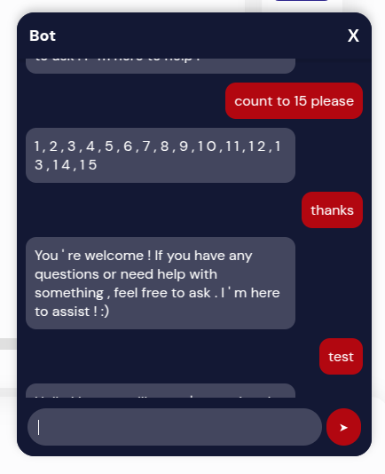

# **rawan-bee-bot**
*A flexible, AI-powered chatbot UI component for React, supporting multiple AI providers (OpenAI, Mistral, self-hosted LLMs).*

## **📌 Features**
- ✅ **Prebuilt Chat UI** – Easily embed a chatbot into any React project.
- ✅ **Multi-AI Support** – Supports **OpenAI, Mistral (self-hosted via Ollama)**.
- ✅ **Theming & Customization** – Modify UI colors, fonts, and styles.
- ✅ **Message Storage** – Supports **local storage & API-based** message saving.
- ✅ **Responsive & Mobile-Friendly** – Works across all screen sizes.

---

## **🚀 Installation**
```sh
npm install rawan-bee-bot
```
or
```sh
yarn add rawan-bee-bot
```

---

## **🔧 Usage**
Import and integrate the chatbot inside your React project:

```tsx
import React from "react";
import ChatbotUI from "rawan-bee-bot";

const App = () => {
  const saveMessageToDatabase = async (message) => {
    await fetch("https://your-api.com/save-message", {
      method: "POST",
      headers: { "Content-Type": "application/json" },
      body: JSON.stringify(message),
    });
  };

  return (
    <ChatbotUI
      aiProvider="selfhosted" // Use "openai" for OpenAI API
      apiKey="YOUR_OPENAI_API_KEY" // Required only for OpenAI
      backendUrl="http://localhost:11434/api/generate" // Required only for Mistral (Ollama)
      theme={{
        chatButtonBg: "#B20710",
        chatButtonTextColor: "#ffffff",
        headerBg: "#131834",
        headerTextColor: "#ffffff",
        closeButtonColor: "#ffffff",
        userMessageBg: "#B20710",
        userMessageText: "#ffffff",
        botMessageBg: "#43465e",
        botMessageText: "#ffffff",
        inputContainerBg: "#131834",
        inputFieldBg: "#43465e",
        inputFieldText: "#ffffff",
        sendButtonBg: "#B20710",
        sendButtonTextColor: "#fff",
        typingIndicatorColor: "#fff",
      }}
      onSaveMessage={saveMessageToDatabase}
    />
  );
};

export default App;
```

---

## **🌍 AI Providers**
This chatbot supports multiple AI backends. Choose one of the following:

### **🔹 OpenAI API**
- Set `aiProvider="openai"` and provide an API key.

```tsx
<ChatbotUI
  aiProvider="openai"
  apiKey="YOUR_OPENAI_API_KEY"
/>
```

### **🔹 Mistral (Self-hosted via Ollama)**
- Requires **Ollama** installed locally.
- Runs a **Mistral model** on `http://localhost:11434/api/generate`.

```tsx
<ChatbotUI
  aiProvider="selfhosted"
  backendUrl="http://localhost:11434/api/generate"
/>
```

---

## **🎨 Customization**
You can **fully customize** the chatbot UI with the `theme` prop:

| Property | Description | Default |
|----------|------------|---------|
| `chatButtonBg` | Chat button background color | `#0084ff` |
| `chatButtonTextColor` | Chat button text color | `#fff` |
| `headerBg` | Header background color | `#0084ff` |
| `headerTextColor` | Header text color | `#fff` |
| `closeButtonColor` | Close button color | `#fff` |
| `userMessageBg` | User message background | `#0084ff` |
| `userMessageText` | User message text color | `#fff` |
| `botMessageBg` | Bot message background | `#e4e6eb` |
| `botMessageText` | Bot message text color | `#000` |
| `inputContainerBg` | Input container background | `#f1f1f1` |
| `inputFieldBg` | Input field background | `#fff` |
| `inputFieldText` | Input field text color | `#000` |
| `sendButtonBg` | Send button background | `#0084ff` |
| `sendButtonTextColor` | Send button text color | `#fff` |
| `typingIndicatorColor` | Typing indicator color | `#666` |

---

## **💾 Saving Messages**
You can **store chat messages** locally or send them to a database.

### **1⃣ Local Storage (Default)**
The chatbot **automatically saves messages** in the browser's `localStorage`.

### **2⃣ Save to Database**
Pass a function to `onSaveMessage` to send messages to an API:

```tsx
const saveMessageToDatabase = async (message) => {
  await fetch("https://your-api.com/save-message", {
    method: "POST",
    headers: { "Content-Type": "application/json" },
    body: JSON.stringify(message),
  });
};

<ChatbotUI onSaveMessage={saveMessageToDatabase} />;
```

---

## **💻 Development**
### **1️⃣ Clone the Repository**
```sh
git clone https://github.com/RawanBee/rawan-bee-bot.git
cd rawan-bee-bot
npm install
```

### **2️⃣ Build the Project**
```sh
npm run build
```

### **4️⃣ Publish to NPM**
```sh
npm publish
```

---

## Screenshot

Here is a preview of the chatbot UI:



---

## **📝 License**
This project is licensed under the **MIT License**. Feel free to use and modify it.

---

## **📞 Support**
For questions and issues, open an **[issue on GitHub](https://github.com/RawanBee/rawan-bee-bot/issues)**.

---

### **🚀 Happy Coding!** 🎉

